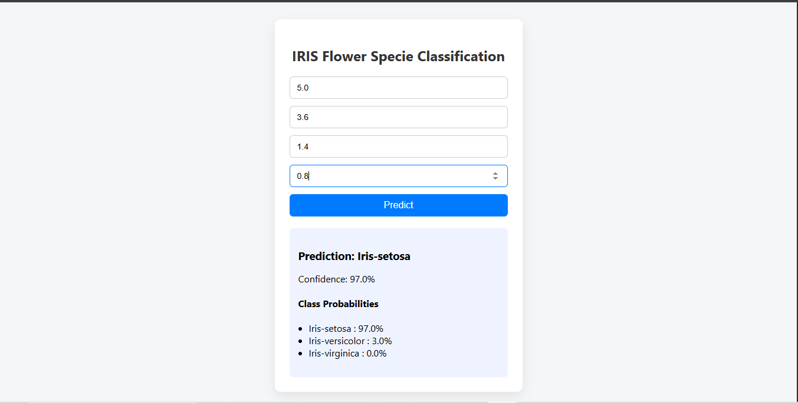

# Flower Species Classification

Predict the species of an Iris flower Setosa, Versicolor or Virginica by using an end-to-end machine learning pipeline and deploy the best model in a web app for user testing.
<p align="center">
  
</p>

## Table of Contents

1. [Project Overview](#project-overview)  
2. [Dataset](#dataset)  
3. [System](#Model-backend-frontend)  
4. [Installation & Usage](#installation--usage)
5. [Results](#results)  
6. [Project Structure](#project-structure)  

---

## Project Overview

This repository implements a complete workflow for multiclass classification on the classic Iris dataset. It covers:

- Data gathering & Loading in Editor  
- Preprocessing (cleaning, encoding, scaling, train/test split)  
- Training and comparing multiple classifiers  
- Selecting and persisting the best model
- Creat8hg a Flask WebApp & deploying the best model
- Getting predictions through a Flask web-interface  

---

## Dataset

- **Source:** Kaggle Iris dataset (150 samples, 4 features)  
- **Classes:**  
  - *Iris-setosa*  
  - *Iris-versicolor*  
  - *Iris-virginica*  
- **Features:** sepal length, sepal width, petal length, petal width  

---

## Pipeline & Model Workflow

### Phase 1 – Preprocessing & Modeling (Jupyter Notebook)

1. **Environment & Libraries**
2. **Data Loading & Exploration**
3. **Data Preprocessing**
4. **Model Training & Comparison**  
5. **Evaluation & Selection**  
6. **Saving Model, Encoder & Scalar as .pkl**
   
---

### Phase 2 – Web Application (Python Script)

1. **Dependencies**
2. **App Initialization**  
3. **Input Handling & Prediction**  
4. **Response Rendering**  
   
---

## Installation & Usage

1. **Clone the repo**  
   ```bash
   git clone https://github.com/<username>/Flower-Species-Classification.git
   cd Flower-Species-Classification

--
## Results

These are results of the Five Algorithms used:
1. 97.78% : Logistic Regression
2. 95.56% : Decision Tree
3. 97.78% : Random Forest
4. 100.0% : SVM
5. 97.78% : Naive Bayes

The Best model is Choosen an SVM with an accuracy of 100%.
